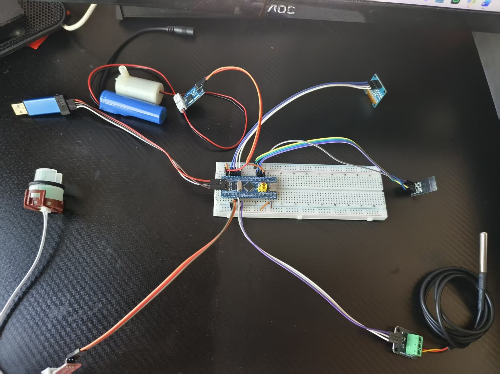
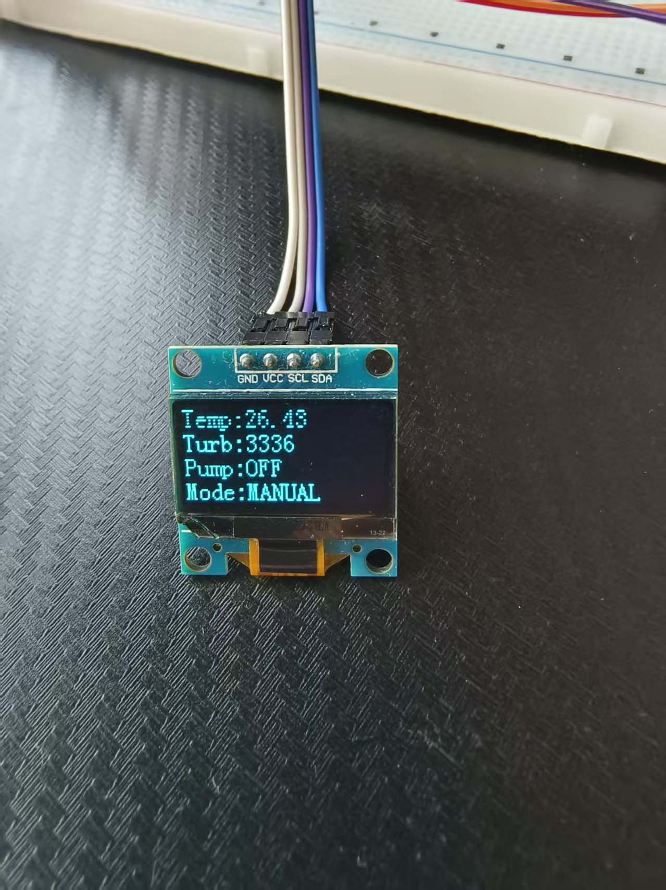
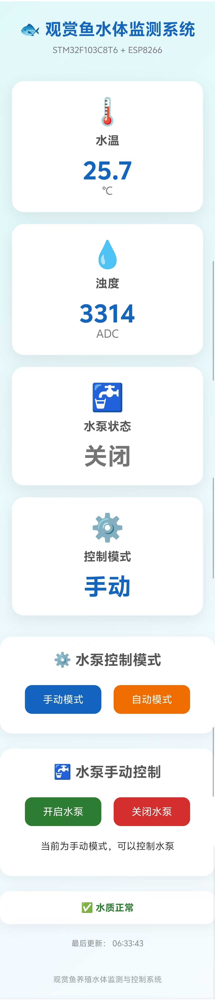

# 🐟 基于 STM32 的观赏鱼养殖水体监测与控制系统

> 基于 STM32F103C8T6 + ESP8266 的观赏鱼养殖水体监测与控制系统

本项目是一套面向观赏鱼养殖场景设计的嵌入式水体监测与控制系统。

系统通过 DS18B20 温度传感器和浊度传感器实时采集水体环境数据，通过 OLED 显示当前运行状态，并利用水泵对水体进行控制。

同时使用 ESP8266 建立 Wi-Fi 通信和 Web Server，实现通过浏览器远程查看水温、浊度、水泵状态，并支持手动 / 自动模式切换和水泵控制。

---

## 📷 项目展示

### 1. 系统整体

系统主要由 STM32F103C8T6、DS18B20、浊度传感器、OLED、ESP8266、MOSFET 模块、水泵以及电源等部分组成。



---

### 2. OLED 实时显示

STM32 通过 OLED 实时显示当前水温、浊度 ADC 值、水泵状态以及控制模式。



OLED 显示示例：

```text
Temp:26.43
Turb:3336
Pump:OFF
Mode:MANUAL
```

| 显示内容含义 | 说明 |
| ------ | ----------- |
| `Temp` | 当前水温 |
| `Turb` | 浊度传感器 ADC 值 |
| `Pump` | 当前水泵状态 |
| `Mode` | 当前控制模式 |

---

### 3. ESP8266 Web 监测页面

ESP8266 建立 Web Server，通过浏览器访问系统网页，可以查看当前水体运行状态。



Web 页面目前可以显示：

- 当前水温
- 当前浊度 ADC 数据
- 水泵状态
- 当前控制模式
- 水质状态
- 最近一次数据更新时间

同时支持：

- 手动模式
- 自动模式
- 水泵开启
- 水泵关闭
- 手动 / 自动模式切换

---

# 📌 项目简介

本项目以 STM32F103C8T6 作为主控制器，实现观赏鱼养殖水体的实时监测与控制。

系统整体工作流程如下：

```text
DS18B20 温度传感器
        │
        ▼
浊度传感器
        │
        ▼
STM32F103C8T6
        │
   ┌────┼────┐
   │    │    │
   ▼    ▼    ▼
 OLED  水泵  USART
 显示  控制    │
               ▼
            ESP8266
               │
             Wi-Fi
               │
               ▼
          Web监测页面
```

STM32 负责：

- 传感器数据采集
- 数据处理
- OLED 显示
- 水泵控制
- USART 串口通信

ESP8266 负责：

- Wi-Fi 网络连接
- 接收 STM32 数据
- 建立 Web Server
- 网页数据显示
- 接收网页控制指令
- 向 STM32 发送控制命令

---

# ⚙️ 系统功能

## 1. 水温检测

使用 DS18B20 数字温度传感器检测养殖水体温度。

主要功能：

- 数字温度检测
- 单总线通信
- STM32 GPIO 模拟时序通信
- 温度数据读取
- OLED 实时显示

当前系统通过温度阈值参与水泵自动控制。

---

## 2. 浊度检测

使用浊度传感器检测水体浑浊程度。

传感器输出模拟电压，由 STM32 ADC 进行采样。

数据流程：

```text
浊度传感器
     │
     │ 模拟电压
     ▼
STM32 ADC
     │
     ▼
ADC 数值
     │
     ▼
浊度判断
```

当前实验中：

```text
ADC 数值越小
      ↓
水体越浑浊
```

系统当前设置浊度判断阈值：

```text
Turbidity < 1500
```

当 ADC 数值低于该阈值时，系统判断水体浑浊程度较高。

> 注意：该阈值为当前实验环境下的测试参数，实际应用时需要根据具体浊度传感器、水体以及实验数据进行标定。

---

# 🚰 水泵控制

水泵通过 MOSFET 模块进行控制。

STM32 使用：

```text
PA8
```

作为水泵控制信号。

控制结构：

```text
STM32 PA8
    │
    ▼
MOSFET 模块
    │
    ▼
5V 水泵
```

水泵控制函数：

```c
Pump_Init();
Pump_ON();
Pump_OFF();
Pump_GetState();
```

---

# 🎮 手动 / 自动控制

系统支持两种工作模式。

## 手动模式

在手动模式下，可以通过 ESP8266 Web 页面控制水泵。

控制流程：

```text
Web页面
   │
   ▼
ESP8266
   │
   ▼
USART
   │
   ▼
STM32
   │
   ▼
PA8
   │
   ▼
MOSFET
   │
   ▼
水泵
```

网页发送：

```text
P=1
```

开启水泵。

网页发送：

```text
P=0
```

关闭水泵。

---

## 自动模式

自动模式下，STM32 根据水温和浊度自动控制水泵。

当前控制逻辑：

```text
Temp > 30
       OR
Turbidity < 1500
       ↓
    水泵开启
```

否则：

```text
Temp <= 30
       AND
Turbidity >= 1500
       ↓
    水泵关闭
```

对应程序逻辑：

```c
if (Temp > 30 || Turbidity < 1500)
{
    Pump_ON();
}
else
{
    Pump_OFF();
}
```

---

# 📡 ESP8266 Wi-Fi 通信

系统使用 ESP-01S ESP8266 模块进行 Wi-Fi 通信。

ESP8266 主要负责：

- 连接 Wi-Fi
- 建立 Web Server
- 接收 STM32 数据
- 向网页提供实时数据
- 接收网页控制指令
- 向 STM32 发送控制命令

STM32 与 ESP8266 通过 USART1 通信。

---

# 🔌 STM32 USART1 接口

STM32F103C8T6 使用 USART1 与 ESP8266 通信。

| STM32功能 | 说明 |
| ------- | ---------- |
| PA9 | USART1_TX |
| PA10 | USART1_RX |
| GND | 共地 |

串口参数：

```text
Baud Rate：115200
Data Bits：8
Stop Bits：1
Parity：None
Flow Control：None
```

连接关系：

```text
STM32 PA9  ─────► ESP8266 RX
STM32 PA10 ◄───── ESP8266 TX
STM32 GND  ────── ESP8266 GND
```

---

# 📦 STM32 → ESP8266 通信协议

STM32 将当前系统状态通过串口发送给 ESP8266。

数据格式：

```text
T=26.5,TU=1200,P=1,M=1
```

参数说明：

| 参数含义 | 说明 |
| ---- | ---------- |
| `T` | 当前温度 |
| `TU` | 当前浊度 ADC 值 |
| `P` | 水泵状态 |
| `M` | 工作模式 |

其中：

```text
P=0  水泵关闭
P=1  水泵开启

M=0  手动模式
M=1  自动模式
```

例如：

```text
T=26.5,TU=1200,P=1,M=1
```

表示：

```text
温度：26.5℃
浊度：1200
水泵：开启
模式：自动
```

---

# 🔄 ESP8266 → STM32 控制指令

网页控制水泵时，ESP8266 向 STM32 发送控制命令。

开启水泵：

```text
P=1
```

关闭水泵：

```text
P=0
```

查询水泵状态：

```text
P?
```

切换到自动模式：

```text
MODE=1
```

切换到手动模式：

```text
MODE=0
```

---

# 🌐 Web Server

ESP8266 建立 Web Server，为浏览器提供系统监测和控制页面。

## 系统主页

```text
/
```

---

## 数据接口

```text
/data
```

用于获取当前系统数据。

---

## 水泵控制

```text
/pump/on
/pump/off
```

---

## 模式控制

```text
/mode/manual
/mode/auto
```

---

# 🖥️ Web 页面功能

网页可以实时显示：

```text
┌─────────────────────────────┐
│     观赏鱼水体监测系统       │
├─────────────────────────────┤
│ 水温：       25.7 ℃          │
│ 浊度：       3314            │
│ 水泵：       OFF             │
│ 模式：       MANUAL          │
│ 水质：       正常             │
├─────────────────────────────┤
│ [手动模式]   [自动模式]       │
│ [开启水泵]   [关闭水泵]       │
└─────────────────────────────┘
```

---

# 🧩 硬件组成

| 硬件功能 | 说明 |
| ------------- | -------- |
| STM32F103C8T6 | 主控制器 |
| DS18B20 | 水温检测 |
| 浊度传感器 | 水体浑浊程度检测 |
| OLED | 本地数据显示 |
| ESP-01S | Wi-Fi 通信 |
| MOSFET 模块 | 水泵驱动 |
| 5V 水泵 | 水体控制 |
| 5V 电源 | 系统供电 |

---

# 💻 软件结构

STM32 部分采用模块化方式进行程序设计。

主要模块：

```text
观赏鱼水体监测与控制系统/
│
├── Hardware/
│   ├── OLED.c
│   ├── OLED.h
│   ├── Temp.c
│   ├── Temp.h
│   ├── Pump.c
│   ├── Pump.h
│   ├── Turbidity.c
│   ├── Turbidity.h
│   ├── USART.c
│   └── USART.h
│
├── System/
│   └── Delay.c
│
└── User/
    └── main.c
```

ESP8266 部分：

```text
ESP8266/
└── WebServer/
    └── WebServer.ino
```

---

# 🛠️ 开发环境

## STM32

```text
MCU：STM32F103C8T6
IDE：Keil MDK
语言：C
下载工具：ST-Link
```

## ESP8266

```text
开发环境：Arduino IDE
开发板：ESP8266
模块：ESP-01S
语言：C++
```

---

# 📚 项目涉及的技术

## STM32

- STM32F103C8T6
- GPIO
- ADC
- USART
- NVIC
- 延时
- 外部模块驱动
- 模块化程序设计

## 传感器

- DS18B20 单总线通信
- 温度数据读取
- 浊度传感器模拟信号采集
- ADC 数据处理

## 显示

- OLED
- I2C 通信
- 实时数据显示

## 控制

- GPIO 控制
- MOSFET
- 水泵控制
- 手动控制
- 自动控制
- 状态管理

## 网络通信

- ESP8266
- Wi-Fi
- USART
- Web Server
- HTTP
- Web 数据交互

## 工程实践

- Keil 工程管理
- Arduino IDE
- Git
- GitHub
- 项目模块化
- README 文档编写

---

# 📁 项目目录

```text
STM32-Ornamental-Fish-Water-System/
│
├── ESP8266/
│   └── WebServer/
│       └── WebServer.ino
│
├── images/
│   ├── system.jpg
│   ├── oled.jpg
│   └── web.jpg
│
├── 观赏鱼水体监测与控制系统/
│   ├── Hardware/
│   ├── Library/
│   ├── Start/
│   ├── System/
│   ├── User/
│   ├── project.uvprojx
│   └── project.uvoptx
│
├── .gitignore
└── README.md
```

---

# 🔄 系统工作流程

```text
        ┌──────────────────┐
        │ DS18B20 温度检测 │
        └────────┬─────────┘
                 │
                 ▼
        ┌──────────────────┐
        │ 浊度传感器检测   │
        └────────┬─────────┘
                 │
                 ▼
        ┌──────────────────┐
        │  STM32F103C8T6   │
        │                  │
        │ 数据采集与处理   │
        └───────┬──────────┘
                │
       ┌────────┼────────┐
       │        │        │
       ▼        ▼        ▼
     OLED      水泵     USART
     显示      控制       │
                         ▼
                    ESP8266
                         │
                         ▼
                    Wi-Fi网络
                         │
                         ▼
                    Web页面
```

---

# 🎯 当前项目完成情况

- STM32F103C8T6 基础开发
- DS18B20 温度检测
- OLED 显示
- 浊度传感器 ADC 检测
- 水泵控制
- MOSFET 驱动水泵
- USART 通信
- ESP8266 Wi-Fi 通信
- ESP8266 Web Server
- Web 页面实时数据显示
- 水泵手动控制
- 水泵自动控制
- 手动 / 自动模式切换
- STM32 与 ESP8266 双向通信
- GitHub 项目管理

---

# 🚀 后续改进方向

## 1. 数据滤波

目前浊度数据直接使用 ADC 采样值，可以增加：

- 多次采样平均
- 滑动平均滤波
- 中值滤波

提高数据稳定性。

---

## 2. 增加控制滞回

当前自动控制采用单阈值判断，后续可以加入滞回区间，减少水泵频繁启停。

例如：

```text
浊度低于 1400
    ↓
开启水泵

浊度高于 1600
    ↓
关闭水泵
```

避免传感器数据在阈值附近波动时造成水泵频繁切换。

---

## 3. 增加历史数据

后续可以增加：

- 温度历史数据
- 浊度历史数据
- 水泵运行记录
- 数据曲线

使 Web 页面能够查看一段时间内的水质变化。

---

## 4. 增加更多传感器

后续可以根据实际需求增加：

- 水位传感器
- pH 传感器
- 溶解氧传感器
- 水温传感器扩展

进一步完善观赏鱼养殖环境监测。

---

# ⚠️ 项目说明

本项目目前主要用于毕业设计学习与实验验证。

其中：

```text
T > 30℃
```

以及：

```text
Turbidity < 1500
```

为当前实验阶段设置的控制阈值。

实际养殖环境中的控制参数需要根据具体鱼种、水体环境、传感器特性以及实验数据进行重新标定。

---

# 👨‍💻 项目作者

**Lzdyds**

本项目用于嵌入式系统学习、毕业设计以及项目实践。

---

# ⭐ 项目总结

本项目以 STM32F103C8T6 为核心，实现了：

```text
传感器数据采集
        ↓
STM32 数据处理
        ↓
OLED 本地显示
        ↓
水泵自动 / 手动控制
        ↓
USART 串口通信
        ↓
ESP8266 Wi-Fi
        ↓
Web 远程监测与控制
```

通过本项目完成了从**底层传感器采集、STM32 控制、串口通信，到 ESP8266 网络通信和 Web 页面显示**的一套完整嵌入式系统实践。